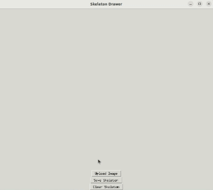

# SketchAnim: Real-time sketch animation transfer from videos

Animation of hand-drawn sketches is an adorable art. It allows the animator to generate animations with expressive freedom and requires significant expertise. In this work, we introduce a novel sketch animation framework designed to address inherent challenges, such as motion extraction, motion transfer, and occlusion. The framework takes an exemplar video input featuring a moving object and utilizes a robust motion transfer technique to animate the input sketch. We show comparative evaluations that demonstrate the superior performance of our method over existing sketch animation techniques. Notably, our approach exhibits a higher level of user accessibility in contrast to conventional sketch-based animation systems, positioning it as a promising contributor to the field of sketch animation.


### Setup:

```
git clone git@github.com:graphics-research-group/SketchAnim.git
cd SketchAnim
```

### Installation:

```
conda env create -f environment.yml
```

Next, install [co-tracker](https://github.com/facebookresearch/co-tracker.git) and [DeformationPyramid](https://github.com/rabbityl/DeformationPyramid.git).

```
git clone https://github.com/facebookresearch/co-tracker.git
git clone https://github.com/rabbityl/DeformationPyramid.git
```


### Draw a skeleton:

Draw the skeleton on the first frame (rest pose) of the video. 

```
python gui.py
```

|  |
| -------------------------------------------------- |


### Animate a sketch:

Run the following notebook to generate the final animation with their intermediate results. Users can use custom hand-drawn sketches.

```
python main.ipynb
```


### Results:

|      |      |
| -------------------------- | -------------------------- |
|  |  |
|  |  |


### Acknowlegement:

We have borrowed the code from [co-tracker](https://github.com/facebookresearch/co-tracker.git), [DeformationPyramid](https://github.com/rabbityl/DeformationPyramid.git) and [BBW](https://github.com/libigl/libigl/blob/main/include/igl/bbw.h) in our work.  We sincerely thank the authors for their valuable contributions to the research community.